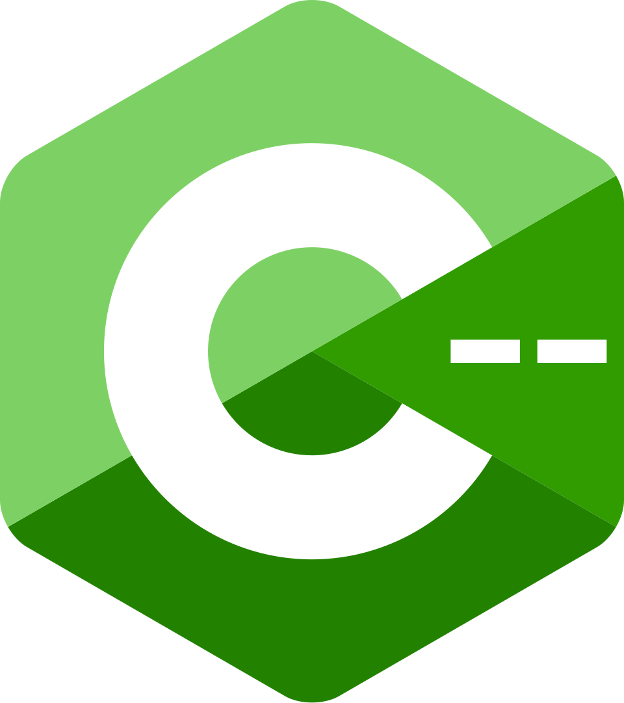

<div align="center">



# C-- (Cmm) Language Reference

*A comprehensive reference for GHC's native C-- (Cmm) intermediate language.*


-blue)


**Documentation • Examples • Compiler Usage • FFI • Language Reference • The RTS Problem**

</div>

---

# Overview

**C-- (Cmm) Language Reference** is a community-driven documentation project dedicated to **C-- (Cmm)**, the native intermediate representation (IR) used internally by the **Glasgow Haskell Compiler (GHC)**.

The goal of this repository is to provide a centralized reference covering the language syntax, compiler usage, practical examples, memory layout, control flow, foreign function interfaces (FFI), and interoperability with native C libraries — as well as the practical realities of using GHC to compile Cmm *outside* of Haskell entirely.

This project is **not** a compiler, framework, runtime environment, or replacement for GHC. Instead, it serves as a complete reference for developers interested in learning, understanding, and writing Cmm programs.

---

# A quick history: where Cmm actually comes from

C-- was originally designed in the late 1990s by Simon Peyton Jones and Norman Ramsey as a **portable assembly language** — a common target any compiler front-end could generate, and any code-generator backend could consume, independent of any one language. An implementation effort, **Quick C--**, tested this design experimentally with support from Microsoft Research, Intel Research, and the NSF. The standalone project was eventually abandoned (archived on GitHub around 2019); LLVM had by then become the more widely adopted "portable assembly language" for new compiler projects.

What survived is a fork: **Cmm**, the intermediate representation GHC still uses internally today. GHC's pipeline goes Haskell → Core → STG → Cmm, and from Cmm, GHC can generate native assembly directly (the default native code generator), hand off to LLVM, or — historically — emit plain C. Cmm is normally *generated automatically* by this pipeline. This repository, and the tools below, exist to make **hand-written** Cmm practical as well.

---

# Features

- Comprehensive C-- (Cmm) language reference
- Syntax documentation
- Practical examples
- GHC compilation guide
- FFI documentation
- Native C ABI examples
- Data sections
- Procedures
- Labels and control flow
- Memory layout examples
- Pointer operations
- **Documented findings on the Haskell RTS footprint in standalone Cmm binaries**
- Community-maintained documentation

---

# Getting Started

## Installing GHC

Cmm programs are compiled directly using the **Glasgow Haskell Compiler (GHC)**.

Download GHC:

https://www.haskell.org/ghc/

---

## Compiling Cmm

Compile a standalone Cmm program:

```bash
ghc -no-hs-main main.cmm -o app
```

The `-no-hs-main` option tells GHC not to link the default Haskell runtime entry point, allowing the Cmm program to define its own `main()` function.

**This works, and produces a correct binary — but read the next section before you rely on it for anything beyond a quick test.**

---

# ⚠️ The hidden cost of `-no-hs-main`: the RTS is still there

`-no-hs-main` only removes GHC's default Haskell entry point. It does **not** stop GHC from statically linking the full Haskell Runtime System into your binary — stack management, thread scheduling, signal handling, all of it — even for a program that never touches Haskell.

We measured this directly on a plain "Hello World" Cmm program:

| Build method | Binary size | RTS symbols present? |
|---|---:|---|
| `ghc -no-hs-main main.cmm -o app` | 1,561,312 bytes | Yes |
| same binary, `strip`'d | 898,816 bytes | Yes (hidden by strip, still linked) |
| compiled with `ghc -c`, linked with plain `cc` | 5,768 bytes | **No** |

That's roughly a **270× size difference**, and it grows further as a program's includes grow (a version using `stdc--.h` showed a **~620×** gap: 9.7 MB vs. 16 KB).

Proof the RTS is really there, from a stock `-no-hs-main` build:

```bash
$ strings app | grep -i stg
stg_stack_underflow_frame: unsupported register
stg_dead_thread entered!
stg_sig_install: bad spi
stg_ap_p_ret
...

$ readelf -d app | grep NEEDED
Shared library: [libgmp.so]     # GHC's Integer implementation
Shared library: [libffi.so]     # GHC's foreign-call/closure machinery
Shared library: [libiconv.so]   # GHC's text-encoding layer
```

None of these are used by a hand-written Cmm program. They're linked because GHC's default *linking* step assumes every binary it produces might need the full runtime.

### The fix: split compile and link

```bash
ghc -c -no-hs-main main.cmm -o main.o    # compile only, produce an object file
cc main.o -o app -lm -lc                  # link with a plain system linker
```

Because a plain C linker has no notion of the Haskell RTS, it only pulls in what the object file actually references. Same program, same behavior, none of the extra weight.

This is exactly what the **[gmm](https://github.com/DASKR515/C-minus-minus/releases/)** tool below automates.

---

# Hello World

```C
#include "Cmm.h"

section "data" {
    msg: bits8[] "Hello, World!\0";
}

export main;

main() {
    foreign "C" puts(msg "ptr");
    foreign "C" exit(0);
}
```

This program declares a string inside the data section and invokes the standard C library function `puts()` using GHC's native Foreign Function Interface.

### ⚠️ Use `exit()`, not `return`, to end `main()`

Notice the last line is `foreign "C" exit(0);`, not `return (0);`. This isn't a style preference:

Cmm's calling conventions were designed around GHC's STG execution model, which expects a specific stack frame layout when a function returns. `main()` compiled and linked without the full RTS present doesn't have that frame set up. The practical result: a plain `return (0);` from `main()` can **segfault after your program has already printed its correct output** — we reproduced this both with `gmm` and with plain `ghc -no-hs-main`, so it is a property of hand-written Cmm's `main()`, not a bug in any particular toolchain.

**Always terminate a hand-written Cmm `main()` with `foreign "C" exit(0);`.**

---

# Using stdc--.h

This repository also references **stdc--.h**, a lightweight helper library that simplifies writing C-- (Cmm) programs while remaining fully compatible with the native C ABI.

Repository:
https://github.com/DASKR515/C-minus-minus/tree/main/stdc--.h

Without **stdc--.h**:

```C
#include "Cmm.h"

section "data" {
    msg: bits8[] "Hi Jordan\0";
}

export main;

main() {
    foreign "C" puts(msg "ptr");
    foreign "C" exit(0);
}
```

With **stdc--.h**:

```C
#include "Cmm.h"
#include "stdc--.h"

section "data" {
    msg: bits8[] "Hi Jordan\0";
}

export main;

main() {
    mout(msg "ptr");
    foreign "C" exit(0);
}
```

The `mout()` helper wraps the standard C `puts()` function, reducing boilerplate while keeping programs clean and readable.

**stdc--.h** is an independent open-source project created and maintained by the author of this repository. Its purpose is to provide lightweight helper functions and common declarations for C-- (Cmm) without modifying the language itself.

> ⚠️ **A note on `cmmath.h`:** the math wrapper bundled alongside `stdc--.h` is still experimental and under active revision. Double-check any constants or results from it before relying on them in real code.

---

# gmm

**`gmm`** is a standalone Go-based command-line tool that automates the fix described above. It wraps GHC's Cmm compilation step and a plain system linker (`cc`) into a single command, and bundles `stdc--.h` / `cmmath.h` directly into its own binary — no separate headers to install or manage.

```bash
gmm -o app main.cmm
```

Internally, this runs:

```bash
ghc -c -no-hs-main -I<bundled-headers> main.cmm -o main.o
cc main.o -o app -lm -lc
```

and produces the same small, RTS-free binary shown in the table above — automatically, every time.

### gmm vs. plain ghc

| | `ghc -no-hs-main main.cmm -o app` | `gmm -o app main.cmm` |
|---|---|---|
| Headers | supply `-I` yourself | bundled, found automatically |
| Output size | multi-MB (RTS statically linked) | few KB (RTS-free) |
| `stg_*` symbols | present | absent |
| Extra deps (`libgmp`, `libffi`, `libiconv`) | pulled in | not pulled in |
| `cmmath.h` warning | none | printed automatically |

**Recommendation: prefer `gmm` over calling `ghc` directly** for any standalone Cmm program. Plain `ghc -no-hs-main` is not wrong — it's what `gmm` uses internally for the compile step — but it silently links the full Haskell RTS on top every time, for no benefit if your program never touches Haskell. `gmm` produces the identical program without that dead weight.

*(See the `gmm` repository for installation and full usage — flags, `--libs`, `--keep-obj`, `--version`.)*

---

# Language Topics

This repository covers:

- Language syntax
- Sections
- Data declarations
- Procedures
- Exported symbols
- Labels
- Branch instructions
- Control flow
- Calling C functions
- Foreign Function Interface (FFI)
- Native C ABI
- Memory layouts
- Pointer operations
- Practical examples
- Compilation with GHC
- **The RTS footprint problem and how to avoid it**

---

# Useful Resources

## Glasgow Haskell Compiler (GHC)

https://www.haskell.org/ghc/

Official compiler used to compile Cmm source files.

---

## GHC User Guide

https://downloads.haskell.org/ghc/latest/docs/users_guide/

Official compiler documentation.

---

## GHC Source Code

https://gitlab.haskell.org/ghc/ghc

Official GHC source repository.

---

## stdc--.h

https://github.com/DASKR515/C-minus-minus/tree/main/stdc--.h

Lightweight helper library for C-- (Cmm).

---

# Contributing

Contributions are welcome.

If you find incorrect information, missing documentation, or would like to improve examples or explanations, feel free to open an issue or submit a pull request.

---

# Project Status

This repository is actively maintained.

Documentation, examples, compiler notes, and language references will continue to expand as additional Cmm features and implementation details are explored.

---

# License

This project is licensed under the **BSD 2-Clause License**.

See the `LICENSE` file for details.

---

# Acknowledgements

- Glasgow Haskell Compiler (GHC) Project
- The Haskell Community
- Simon Peyton Jones, Norman Ramsey, and the original C-- / Quick C-- research effort
- Contributors to GHC and Cmm documentation

Special thanks to everyone contributing documentation, examples, and research related to the C-- (Cmm) language.
